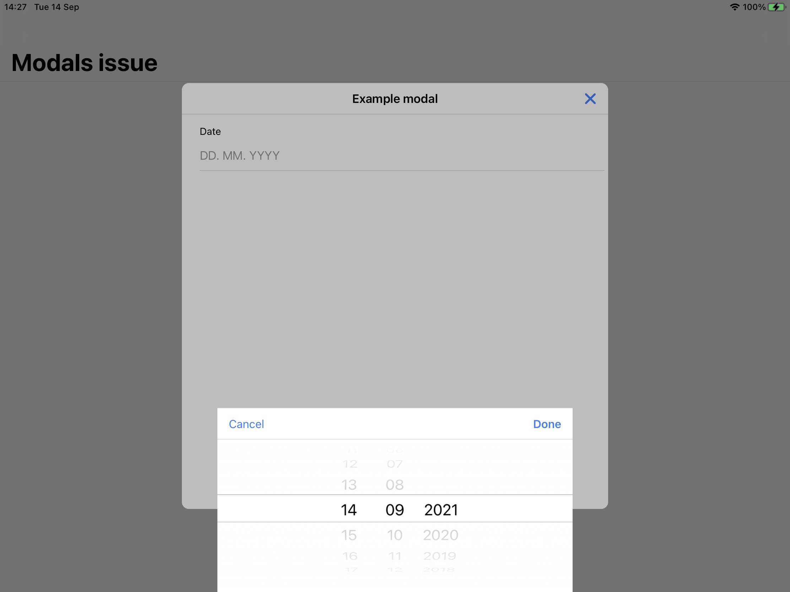
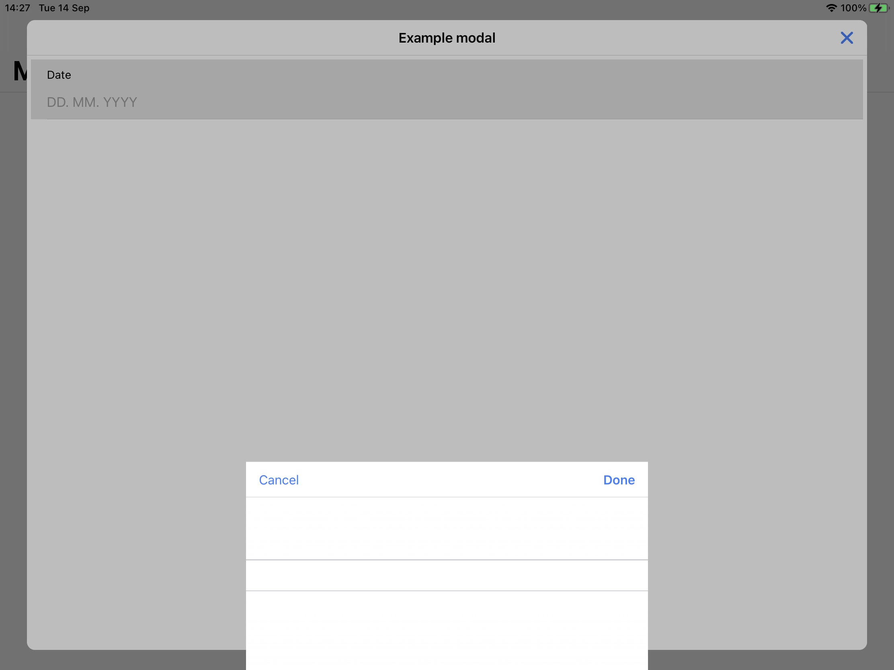

# Ionic modals issue

## Current behaviour

Datetime wheels are not shown after click datetime input is clicked in a modal with custom width and height.

## Expected Behavior

Datetime wheels should be shown immediately after datetime input is clicked.

## Steps to Reproduce

- create modal
- add `ion-datetime` input into modal
- create custom class for modal:
  ```
  .modal-xxl .modal-wrapper {
    --width: 94vw;
    --min-width: 94vw;
    --max-width: 94vw;
    --height: 94vh;
    --min-height: 94vh;
    --max-height: 94vh;
  }
  ```
- open modal with `modal-xxl` cssClass
  ```
  this.modalCtrl.create({
    component: ExampleModalComponent,
    cssClass: 'modal-xxl'
  }).then(modal => modal.present()); 
  ```

## Standard modal example



## XXL modal example


